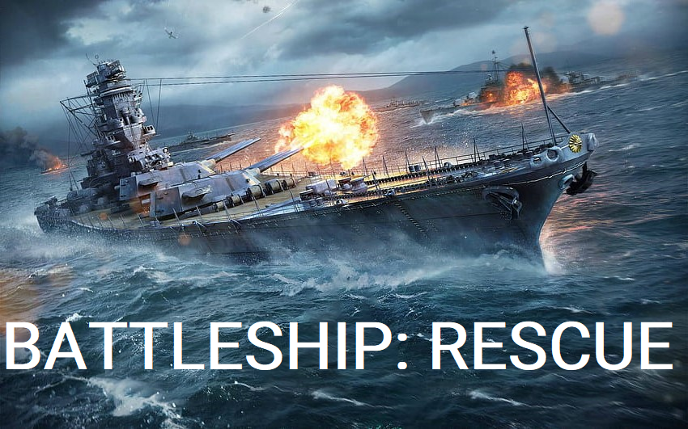

## Battleship Rescue

* This app has been deployed, however it requires further developement to be functional and playable.

The screenshots below give an outline of the intended design and functionality of the app.

At the initial screen, the user is prompted to enter a difficulty level which will determine the size of the game board (Easy 5x5, Normal 6x6 and Hard 7x7), validation is also performed on the inputs at this step.

The user is then prompted to enter a name, validation is also performed on the input.

The mission details are then displayed, along with a prompt for the user to accept, validation is also performed on the inputs.

If the user enters 'no' to the acceptance prompt, the program will display a message and exit.

If the user enters 'yes' and accepts the mission, a game board will then be displayed.

On this screen, the user will be prompted to enter coordinates to fire upon (row, column), validation is also performed on the inputs.

Feedback will be provided to the user on the result of their shot with a message at the bottom of the screen (this will highlight whether an enemy ship was sunk, a merchant ship was sunk or if the shot missed)

BUGS: I was unable to get the 'check shot' function to work as intended, this resulted in the game being deployed in an unfinished state.

